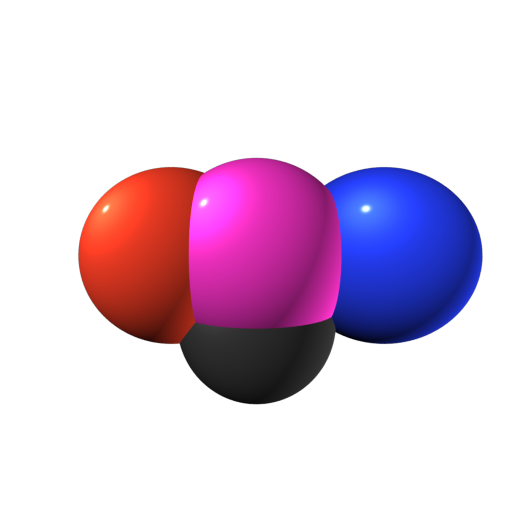
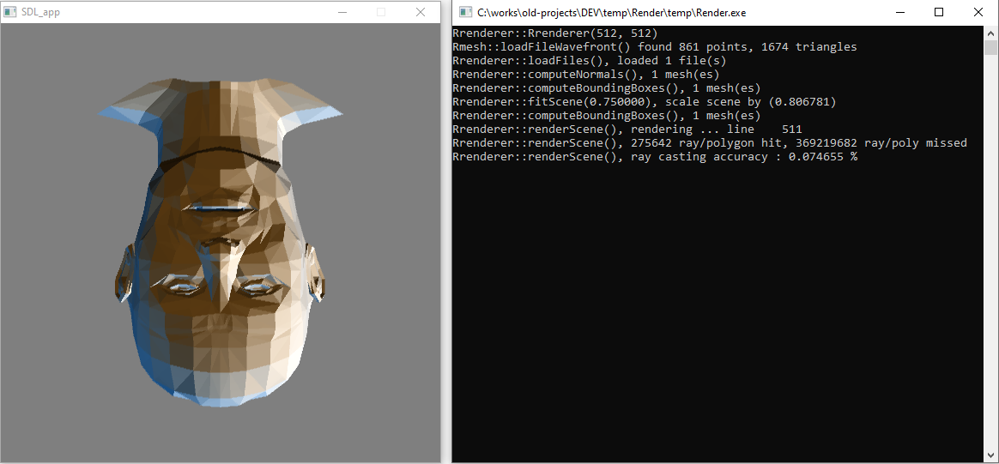

# Toy  raytracer in C++ (circa 2003)

This is a super old project, probably my first real C++ project ever. Can load an .OBJ file and raytrace it.<br>
The initial version was only able to trace spheres with a color and specular attribute. The specular reflections were most probably wrong.<br>
A couple of days later, it slowly evolved into a polygon raytracer than can load and render .OBJ files.<br>
_It is presented here for archival purpose only._<br>
<br>
The original comment says:

```
// Simple (read 'basic') raytracer written in 3 days (3 days for that crappy spheres ?! :)
// C++ ugly code by http://fra.dozign.com
// Raytracer featuring spheres primitives, no shadow casting, unlimited pointlights support (wow)
// and an improvised specular shading model ...

// In no event shall the author be liable for any indirect or
// consequential damages or loss of data resulting from use
// or performance of this software.
```

### Rendering examples


<br>
